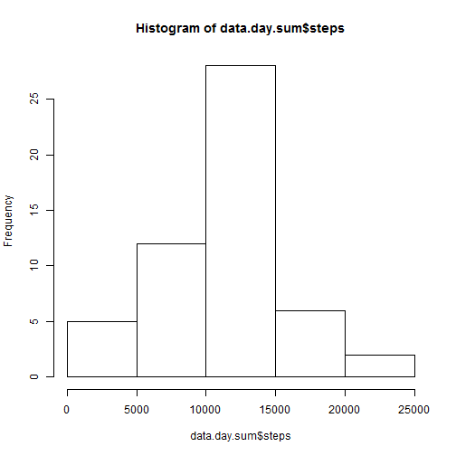
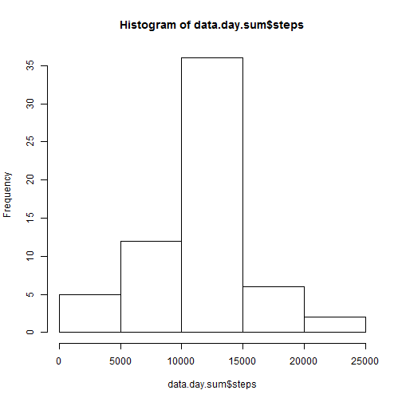

# Reproducible Research: Peer Assessment 1

This assignment makes use of data from a personal activity monitoring device. This device collects data at 5 minute intervals through out the day. The data consists of two months of data from an anonymous individual collected during the months of October and November, 2012 and include the number of steps taken in 5 minute intervals each day.

#### Data

The data for this assignment can be downloaded from the course web site:
Dataset: Activity monitoring data [52K]

The variables included in this dataset are:  
* steps: Number of steps taking in a 5-minute interval (missing values are coded as NA)  
* date: The date on which the measurement was taken in YYYY-MM-DD format  
* interval: Identifier for the 5-minute interval in which measurement was taken  

The dataset is stored in a comma-separated-value (CSV) file and there are a total of 17,568 observations in this dataset.


## Loading and preprocessing the data

```r
if (file.exists("activity.csv") == FALSE) {
    link <- "https://d396qusza40orc.cloudfront.net/repdata%2Fdata%2Factivity.zip"
    print("Please wait, the file being downloaded is about ~20MB compressed")
    download.file(link, destfile = "./activity_data.zip")
    unzip("activity_data.zip")
    unlink("activity_data.zip", recursive = T)
    print("Download Complete.")
} else {
    print("activity.csv already exists in working directory, proceeding using this dataset")
}
```

```
## [1] "activity.csv already exists in working directory, proceeding using this dataset"
```


```r
data <- read.table("activity.csv", header = TRUE, sep = ",", stringsAsFactors = FALSE)
```


```r
# munge data
data$date <- as.Date(data$date, "%Y-%m-%d")
data$steps <- as.integer(data$steps)
```


## What is mean total number of steps taken per day?


```r
require(reshape2)
```

```
## Loading required package: reshape2
```

```r
myvars          <- c("date", "steps")
molten          <- melt(data[,myvars], id= c("date"), na.rm=TRUE)
data.day.sum    <- dcast(molten, date ~ variable
                       , sum
                     # , fun.aggregate = mean
                     # , median
                       , na.rm=TRUE)
```


```r
options(scipen = 0, digits = 7)

# Make a histogram of the total number of steps taken each day
hist(data.day.sum$steps, breaks = 5)
```

 

```r

# Calculate and report the mean and median total number of steps taken per
# day
summary(data.day.sum$steps)
```

```
##    Min. 1st Qu.  Median    Mean 3rd Qu.    Max. 
##      41    8841   10760   10770   13290   21190
```


Answer: The mean total number of steps taken per day is 1.077 &times; 10<sup>4</sup>, the Median is 1.076 &times; 10<sup>4</sup> !!!!


## What is the average daily activity pattern?
        

```r
require(reshape2)
myvars          <- c("interval", "steps")
molten          <- melt(data[,myvars], id= c("interval"), na.rm=TRUE)
data.int.mean   <- dcast(molten, interval ~ variable
                     # , sum
                       , fun.aggregate = mean
                     # , median
                       , na.rm=TRUE)
```


```r
# Make a time series plot (i.e. type = 'l') of the 5-minute interval
# (x-axis) and the average number of steps taken, averaged across all days
# (y-axis)
plot(data.int.mean$interval, data.int.mean$steps, type = "n", main = "", xlab = "Interval", 
    ylab = "Average Number of Steps")
lines(data.int.mean$interval, data.int.mean$steps, type = "l")
```

 

```r

# Which 5-minute interval, on average across all the days in the dataset,
# contains the maximum number of steps?
maxSteps <- data.int.mean[data.int.mean$steps == max(data.int.mean$steps), ]
```


Answer: On average across all the days the most steps are taken in interval 835

## Imputing missing values


```r

# Calculate and report the total number of missing values in the dataset
# (i.e. the total number of rows with NAs)

data.clean <- data[!is.na(data$steps), ]
data.imputed <- data[is.na(data$steps), ]

# Devise a strategy for filling in all of the missing values in the
# dataset. The strategy does not need to be sophisticated. For example,
# you could use the mean/median for that day, or the mean for that
# 5-minute interval, etc.

# impute NA with interval mean
data.imputed <- merge(data.imputed, data.int.mean, by = c("interval"))
data.imputed$steps.x <- data.imputed$steps.y
data.imputed <- data.imputed[, 1:3]

# Rename Last Column ### dim(data)[2]
nn <- names(data.imputed)
nn[2] <- c("steps")
names(data.imputed) <- nn

# Create a new dataset that is equal to the original dataset but with the
# missing data filled in.

# union clean and cleaned-up data
data <- rbind(data.clean, data.imputed)


# Make a histogram of the total number of steps taken each day and
# Calculate and report the mean and median total number of steps taken per
# day. Do these values differ from the estimates from the first part of
# the assignment? What is the impact of imputing missing data on the
# estimates of the total daily number of steps?
```


```r
require(reshape2)
myvars          <- c("date", "steps")
molten          <- melt(data[,myvars], id= c("date"), na.rm=TRUE)
data.day.sum    <- dcast(molten, date ~ variable
                       , sum
                     # , fun.aggregate = mean
                     # , median
                       , na.rm=TRUE)
```


```r
options(scipen = 0, digits = 7)
hist(data.day.sum$steps, breaks = 5)
```

 

```r
summary(data.day.sum$steps)
```

```
##    Min. 1st Qu.  Median    Mean 3rd Qu.    Max. 
##      41    9819   10770   10770   12810   21190
```


Answer: There are 2304 NA values in the data set. The other 15264 rows are clean. The Impute-Strategy is to replace the NA values with the interval's mean. After doing so and repeating the analysis above the histogramm and the summary data look slightly different. The additional observations increase the peak at the mean - which now represents the median, too. 


## Are there differences in activity patterns between weekdays and weekends?


```r
# Options
Sys.setlocale(category = "LC_ALL", locale = "English_United States.1252")
```

```
## [1] "LC_COLLATE=English_United States.1252;LC_CTYPE=English_United States.1252;LC_MONETARY=English_United States.1252;LC_NUMERIC=C;LC_TIME=English_United States.1252"
```

```r

# Add variable weekday
weekend <- (weekdays(data$date) == "Saturday" | weekdays(data$date) == "Sunday")
data$weekday <- "weekday"
data[weekend, ]$weekday <- "weekend"
data[!weekend, ]$weekday <- "weekday"
```


Daily activity pattern calcuation with imputed data by weekday

```r
require(reshape2)
myvars          <- c("interval", "steps","weekday")
molten          <- melt(data[,myvars], id= c("interval", "weekday"), na.rm=TRUE)
data.int.mean   <- dcast(molten, interval+weekday ~ variable
                     # , sum
                       , fun.aggregate = mean
                     # , median
                       , na.rm=TRUE)
```


```r
options(scipen = 0, digits = 5)
library(lattice)
# kernel density plot
xyplot(data.int.mean$steps ~ as.numeric(data.int.mean$interval) | as.factor(data.int.mean$weekday), 
    main = "", type = "l", xlab = "Interval", ylab = "Number of Steps", panel = function(...) {
        panel.xyplot(...)
    }, layout = c(1, 2))
```

 


Answer: As the graphs show there are certainly differences between weekend and weekday in the behaviour of our one subject over the course of the day, especially between 05:30 and 08:30 in the morning.
